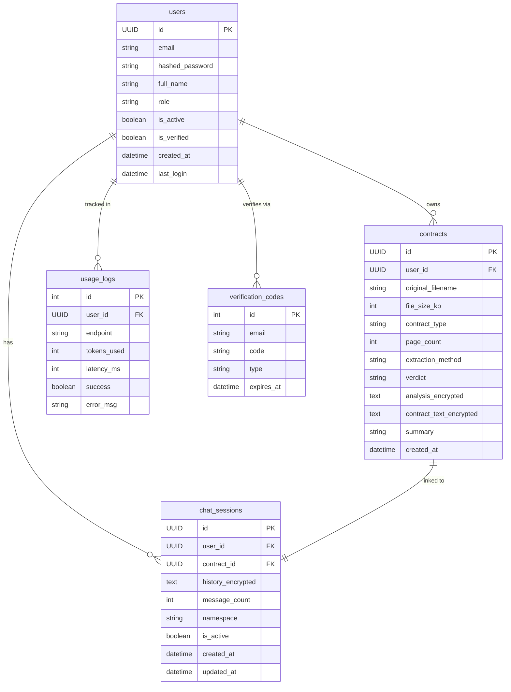

<div align="center">

# بصيرة — Basira
### Read Your Contract With Expert Eyes

AI-Powered Saudi Legal Contract Analyzer — built with RAG, GPT-4o, and Pinecone.

[](https://basira1.netlify.app/)
[](https://fastapi.tiangolo.com/)
[](https://react.dev/)
[](https://openai.com/)
[](https://pinecone.io/)

### 🔗 [basira1.netlify.app](https://basira1.netlify.app/)

</div>

## Team

<table>
  <tr>
    <td align="center"><br/><b>Mooj Ahmed</b><br/>Algoot</td>
    <td align="center"><br/><b>Shamah</b><br/>Alshahrani</td>
    <td align="center"><br/><b>Amjad Fahad</b><br/>Althobaiti</td>
    <td align="center"><br/><b>Lama Saad</b><br/>Alsubaie</td>
  </tr>
</table>

---

---

## Overview

Basira solves a real problem: most people sign legal contracts without fully understanding the clauses or knowing their rights. The platform accepts PDF or scanned image uploads of Saudi legal contracts, extracts the text, classifies the contract type, retrieves relevant Saudi legal regulations from a vector database, and produces a structured legal analysis. Users can then continue in a chat session with a specialized AI legal advisor persona tailored to their contract type.

---

## Features

### Contract Analysis
Accepts both digital PDF files and scanned document images. Text is extracted using PyMuPDF for digital files and GPT-4o Vision for scanned images, ensuring full coverage across all document types — including handwritten or older printed contracts.

### Safety Score
The system issues a three-level verdict on every contract:
- **Safe** — the contract complies with Saudi regulations and contains no dangerous clauses
- **Needs Review** — contains ambiguous or potentially harmful clauses worth flagging
- **Dangerous** — contains clauses that violate Saudi law or the second party's rights

### Clause Classification
Every clause is classified into one of three categories with a detailed explanation and compliance reference:
- **Safe clauses** — compliant with regulations and clearly worded
- **Dangerous clauses** — violate regulations or harm the second party
- **Unclear clauses** — ambiguous wording that needs clarification or renegotiation

### AI Legal Advisor
After analysis, a chat session opens with an advisor specialized in the detected contract type. The advisor has full awareness of the contract content and analysis results, and answers the user's specific questions. The system also auto-suggests smart questions based on discovered clauses.

### Contract Draft Generator
Users can generate a complete contract draft from scratch (employment, rental, or NDA) through a simple step-by-step wizard, and download it immediately as a Word document ready for use.

---

## Tech Stack

| Layer | Technology | Why We Chose It |
|-------|-----------|----------------|
| Frontend | React 18 · TypeScript · Vite · Tailwind CSS | Fast development, type safety, responsive UI |
| Backend | Python 3.11 · FastAPI · SQLAlchemy (async) · Uvicorn | High performance async, auto Swagger docs |
| Database | SQLite via `aiosqlite` | Lightweight with full async support |
| Vector DB | Pinecone — 3 namespaces | Fast semantic search across thousands of legal clauses |
| LLM | GPT-4o + GPT-4o-mini | GPT-4o for deep analysis, mini for query expansion at lower cost |
| Embeddings | `text-embedding-3-large` | Highest accuracy embeddings available from OpenAI |
| Re-ranker | `mmarco-mMiniLMv2-L12-H384-v1` | Re-scores retrieved results to filter noise and boost precision |
| PDF Extraction | PyMuPDF · GPT-4o Vision | Full coverage: digital PDFs and scanned images |
| Encryption | Fernet (AES-128-CBC) | Encrypts sensitive data at rest in the database |
| Auth | JWT · bcrypt · Email OTP | Multi-layer security with email verification |
| Deploy | Docker · Netlify · Render | Frontend on Netlify, backend on Render via Docker |

---

## System Architecture


---

## RAG Pipeline — Full Breakdown

Basira uses an advanced RAG (Retrieval-Augmented Generation) pipeline designed specifically for the Saudi legal context.

### 1. File Upload & Initial Processing
The system accepts digital PDFs or scanned images (JPG/PNG). Text is extracted automatically via one of two paths:
- **PyMuPDF** → for digital files: direct and fast extraction while preserving page structure
- **GPT-4o Vision** → for scanned images: visual analysis that handles Arabic handwriting and legacy print

### 2. PII Redaction
Before any model call, an automatic redaction layer removes national ID numbers, phone numbers, IBAN numbers, and party names — ensuring no personally identifiable information leaks to external AI models.

### 3. Contract Type Classification
The contract is automatically classified into one of four types: `rent` · `labor` · `nda` · `other`. This determines which Pinecone namespace is searched and which AI advisor is activated.

### 4. Multi-Query Expansion (HyDE)
Instead of searching with raw text, the system uses GPT-4o-mini to generate **5 hypothetical paragraphs** describing what you would expect to find in the legal database. This technique (Hypothetical Document Embeddings) significantly improves retrieval quality by aligning query language with legal document language.

### 5. Vector Search & Re-ranking

```
text-embedding-3-large      →  embed each hypothetical paragraph
Pinecone (target namespace)  →  retrieve top-40 results
cross-encoder re-ranker      →  re-rank and filter to top-8
```

The cross-encoder scores each result as a (query, document) pair — significantly outperforming vector similarity alone.

### 6. Structured Legal Output
GPT-4o receives the retrieved clauses and contract text, then produces:
- **Verdict** — overall judgment: `safe` / `review` / `dangerous`
- **Per-clause analysis** — explanation, confidence score, and Saudi law reference
- **Recommendations** — concrete steps the user should take
- **Executive summary** — quick overview of the contract's key points


---

## AI Advisor Personas

Each advisor is configured with a specialized system prompt reflecting deep knowledge of Saudi law in their domain, with full access to the contract content and analysis results.

| Advisor | Specialty | Namespace | Description |
|---------|-----------|-----------|-------------|
| **Sara** | Rental & real-estate contracts | `rent` | Specialized in Saudi tenancy law, landlord and tenant rights, maintenance obligations, and eviction clauses |
| **Muhammad** | Labor law & employment contracts | `labor` | Expert in Saudi Labor Law — salary clauses, leave entitlements, end-of-service awards, and probation periods |
| **Joud** | NDAs, confidentiality & data protection | `nda` | Specialized in non-disclosure clauses, intellectual property, and commercial information protection |
| **Legal Team** | Mixed or unclassified contracts | `both` | Activated for contracts that don't fall into a specific category, delivers comprehensive multi-domain analysis |

---

## Database Schema



**Key Relationships**
- `users` is the central entity — owns contracts, chat sessions, usage logs, and verification codes
- Each `contract` is linked 1:1 to a `chat_session` — every analyzed contract gets its own independent session
- `usage_logs` records every API request with token count and latency for performance monitoring
- `verification_codes` carry a 5-minute TTL ensuring OTP codes expire automatically

---

## Security

Security was a core design principle from day one, not an afterthought.

| Layer | Detail |
|-------|--------|
| **bcrypt** | Password hashing with adaptive salt rounds — resistant to brute-force attacks |
| **JWT (24h expiry)** | Signed tokens with a secret key, automatically expire after 24 hours |
| **Fernet (AES-128-CBC)** | Contract text and full chat history encrypted at rest — unreadable even if the database is compromised |
| **PII Redaction** | National IDs, phone numbers, IBANs, and party names stripped automatically before any data reaches external AI models |
| **Email OTP** | Verification required on registration and password reset — 6-digit code with 5-minute TTL |

---

## Getting Started

### Prerequisites

- Python 3.10+
- Node.js 18+
- API keys: OpenAI · Pinecone · SMTP

### Backend

```bash
cd basira-backend
pip install -r requirements.txt

# Copy and populate environment variables
cp .env.example .env

python main.py
# API:  http://localhost:7860
# Docs: http://localhost:7860/docs
```

### Frontend

```bash
cd Frontend
npm install
npm run dev
# App: http://localhost:5173
```

### Environment Variables

```env
# OpenAI
OPENAI_API_KEY=sk-...

# Pinecone
PINECONE_API_KEY=...
PINECONE_INDEX_NAME=basira-legal

# JWT & Encryption
SECRET_KEY=your-jwt-secret-key
FERNET_KEY=your-fernet-key
# Generate with: python -c "from cryptography.fernet import Fernet; print(Fernet.generate_key().decode())"

# Email (SMTP)
SMTP_HOST=smtp.gmail.com
SMTP_PORT=587
SMTP_USER=your-email@gmail.com
SMTP_PASSWORD=your-app-password
```

---

## Project Structure

```
capstone-project-team/
│
├── data/
│   ├── clean_data/
│   │   ├── labor_contracts_final_clean.xlsx      # Cleaned labor contract clauses dataset
│   │   ├── nda_clauses_master_clean1.xlsx         # Cleaned NDA clauses dataset
│   │   └── rental_contracts_master_clean.xlsx     # Cleaned rental contract clauses dataset
│   └── json/
│       ├── labor_contracts_final_clean.json
│       ├── nda_clauses_master_clean1.json
│       └── rental_contracts_master_clean.json
│
├── Notebook/
│   ├── cleaning/
│   │   ├── cleaning_labor_nda.ipynb               # Data cleaning pipeline for labor & NDA
│   │   ├── Reference update.py                    # Legal reference normalization script
│   │   └── rental_cleaning.ipynb                  # Data cleaning pipeline for rental
│   ├── Vector_DB_Pinecone.ipynb                   # Embedding generation & Pinecone index upload
│   ├── colab_api.ipynb
│   ├── extract_contract-2.py                      # Contract text extraction experiments
│   └── rag_finalv3.py                             # Final RAG pipeline — production-ready version
│
├── basira-backend/
│   ├── app/
│   │   ├── api/
│   │   │   └── routes/
│   │   │       ├── __init__.py
│   │   │       ├── admin.py                       # Admin dashboard statistics endpoint
│   │   │       ├── auth.py                        # Register · login · OTP verify · password reset
│   │   │       ├── chat.py                        # Chat sessions: contract-linked & general
│   │   │       ├── contracts.py                   # Upload, analyze, list, detail, delete
│   │   │       └── draft.py                       # Contract draft generation & Word export
│   │   ├── core/
│   │   │   ├── __init__.py
│   │   │   └── config.py                          # Environment config via Pydantic Settings
│   │   ├── db/
│   │   │   ├── __init__.py
│   │   │   └── database.py                        # Async SQLAlchemy engine & session factory
│   │   ├── models/
│   │   │   └── __init__.py                        # SQLAlchemy ORM models
│   │   ├── schemas/
│   │   │   └── __init__.py                        # Pydantic request/response schemas
│   │   ├── services/
│   │   │   ├── __init__.py
│   │   │   ├── auth.py                            # JWT creation & validation, bcrypt hashing
│   │   │   ├── email.py                           # OTP email delivery via SMTP
│   │   │   ├── encryption.py                      # Fernet encrypt/decrypt wrapper
│   │   │   ├── pdf_extractor.py                   # PyMuPDF + GPT-4o Vision text extraction
│   │   │   └── rag.py                             # Full RAG pipeline: PII → classify → embed → retrieve → rerank → analyze
│   │   └── __init__.py
│   ├── migrations/
│   │   └── versions/
│   │       └── a1bac2e718fc_add_contract_text_encrypted.py
│   ├── .gitignore
│   ├── Dockerfile
│   ├── alembic.ini
│   ├── legal.db
│   ├── main.py                                    # Application entry point
│   └── requirements.txt
│
├── Frontend/
│   ├── src/
│   │   ├── components/
│   │   │   ├── AdvisorChat.tsx                    # AI advisor chat interface
│   │   │   ├── AnalysisSummary.tsx                # Analysis results summary card
│   │   │   ├── AnalyzingProgress.tsx              # Upload & analysis progress indicator
│   │   │   ├── AuthModal.tsx                      # Login / register modal
│   │   │   ├── BasiraLogo.tsx
│   │   │   ├── ClauseCard.tsx                     # Single clause detail card
│   │   │   ├── ClauseList.tsx                     # Filterable clause list (all/safe/dangerous/unclear)
│   │   │   ├── ContractChat.tsx                   # Contract-linked chat wrapper
│   │   │   ├── ContractDraftModal.tsx             # 3-step contract draft wizard
│   │   │   ├── Dashboard.tsx                      # User dashboard — contract history
│   │   │   ├── FeaturesSection.tsx
│   │   │   ├── FilePreview.tsx                    # Uploaded file preview
│   │   │   ├── Footer.tsx
│   │   │   ├── GeneralChat.tsx                    # General legal Q&A interface
│   │   │   ├── Header.tsx
│   │   │   ├── HeroSection.tsx                    # Landing page hero
│   │   │   ├── RiskScoreCard.tsx                  # Safety score gauge (0–100)
│   │   │   ├── StatusBadge.tsx                    # Safe / Review / Dangerous badge
│   │   │   ├── SuggestedQuestions.tsx             # Auto-generated question suggestions
│   │   │   ├── UploadArea.tsx                     # Drag-and-drop file upload
│   │   │   └── WhyBasiraSection.tsx
│   │   ├── data/
│   │   │   └── mockData.ts
│   │   ├── hooks/
│   │   │   └── useAuth.ts                         # Authentication state hook
│   │   ├── services/
│   │   │   └── api.ts                             # Typed API client — all backend requests
│   │   ├── App.tsx
│   │   ├── index.css
│   │   └── index.tsx
│   ├── .eslintrc.cjs
│   ├── .gitignore
│   ├── index.html
│   ├── package-lock.json
│   ├── package.json
│   ├── postcss.config.js
│   ├── tailwind.config.js
│   ├── tsconfig.json
│   ├── tsconfig.node.json
│   └── vite.config.ts
│
├── .gitignore
├── Readme.md
└── main.py
```

---

## API Reference

| Method | Path | Description |
|--------|------|-------------|
| `POST` | `/api/auth/register` | Create account and send email verification OTP |
| `POST` | `/api/auth/login` | Authenticate and receive JWT |
| `POST` | `/api/auth/verify-email` | Verify email with OTP code |
| `POST` | `/api/auth/forgot-password` | Send password reset OTP |
| `POST` | `/api/auth/reset-password` | Reset password with OTP |
| `GET` | `/api/auth/me` | Get current user profile |
| `POST` | `/api/contracts/analyze` | Upload contract file and run full analysis pipeline |
| `GET` | `/api/contracts/` | List all contracts for the authenticated user |
| `GET` | `/api/contracts/stats` | User usage statistics |
| `GET` | `/api/contracts/{id}/detail` | Full analysis results for a specific contract |
| `DELETE` | `/api/contracts/{id}` | Delete a contract and its associated session |
| `POST` | `/api/chat/` | Send a message in a contract-linked chat session |
| `POST` | `/api/chat/general` | General legal question without a contract |
| `GET` | `/api/chat/{session_id}/history` | Retrieve full chat history for a session |
| `DELETE` | `/api/chat/{session_id}` | Delete a chat session |
| `POST` | `/api/draft/generate-docx` | Generate and download a Word contract draft |
| `GET` | `/api/admin/stats` | Admin dashboard statistics |
| `GET` | `/health` | Service health check |

> Full interactive docs available at `/docs` when running locally.

---

## Versioning

| Version | Milestone | Details |
|---------|-----------|---------|
| **V1** | Core upload + analysis | File upload, text extraction, basic GPT-4o analysis |
| **V2** | RAG pipeline + chat | Pinecone integration, advisor chat sessions linked to contracts |
| **V3** | Re-ranking + PII + Export | Cross-encoder re-ranker, PII redaction layer, Word export, admin dashboard |

---


---

> **Disclaimer:** Basira provides preliminary legal guidance only and does not substitute for advice from a qualified attorney.
